# 📊 Análisis Exploratorio de Datos con BigQuery y Colab Enterprise


## Descripción general
En este lab, aprenderás el proceso de analizar un conjunto de datos almacenado en BigQuery con Colab Enterprise para realizar consultas . El análisis te ayudará a descubrir patrones en los datos.

## Objetivos de aprendizaje

- Crear un notebook de Colab Enterprise
- Conectarte a conjuntos de datos de BigQuery
- Realizar un análisis estadístico en un DataFrame de Pandas
- Crear diagramas de Seaborn para realizar un análisis exploratorio de datos en Python
- Escribir una consulta en SQL para seleccionar campos específicos de un conjunto de datos de BigQuery
- Usar el historial de versiones para ver los cambios de código
- Compartir un notebook de Colab Enterprise

---

**Vertex AI** es una plataforma unificada para compilar, implementar y administrar aplicaciones de aprendizaje automático (AA).

**Vertex AI Colab Enterprise** es una poderosa herramienta interactiva colaborativa creada para explorar, analizar, transformar y visualizar datos, además de compilar modelos de aprendizaje automático en Google Cloud. 

BigQuery es un almacén de datos sin servidores, potente y completamente administrado que te permite analizar y administrar grandes conjuntos de datos con facilidad. Este producto utiliza un dialecto de SQL estándar conocido, lo que facilita su uso para los analistas y científicos de datos, que no necesitan aprender un lenguaje nuevo.

Vertex AI ofrece dos soluciones de notebook: **Workbench y Colab Enterprise.**


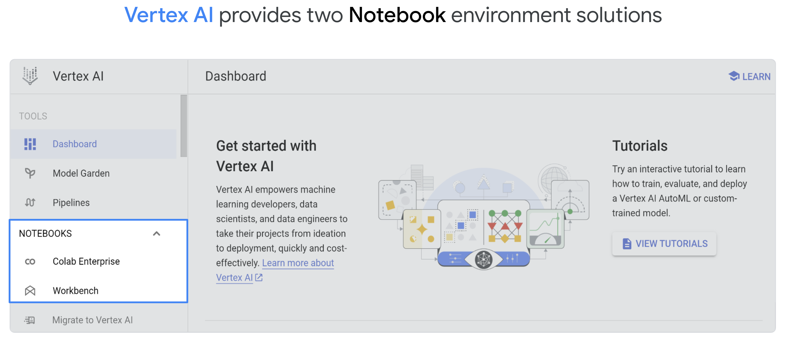

## Colab Enterprise

El espacio de trabajo de Colab Enterprise consta de cinco secciones principales (como se muestra en la siguiente imagen): 

- (1) almacenamiento de notebooks, 
- (2) acciones para notebooks, 
- (3) entornos de ejecución y plantillas de entornos de ejecución, 
- (4) editor de notebooks y (5) celdas de código de notebooks. 


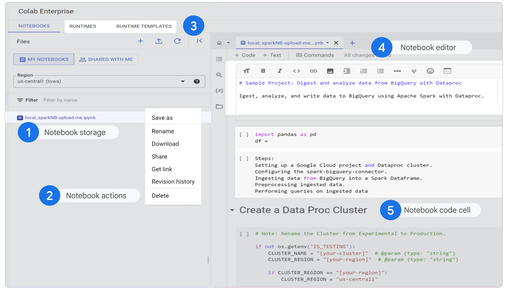


----

# Laboratorio

#

## Tarea 1. Configura tu entorno

1 - Habilita la **API de Vertex AI**

#
## Tarea 2. Crea un notebook de Colab Enterprise

1 - En la sección Vertex AI, desplázate hacia abajo hasta Notebooks. Haz clic en **Colab Enterprise**.

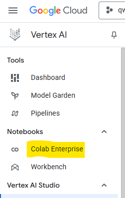

2 - En el menú **Región**, selecciona la región la que crearás el notebook. ( este Dato te lo da cuando Inicias el Lab)

3 - Haz clic en **+ CREAR NOTEBOOK**.

4 - Haz clic en **PLANTILLAS DE ENTORNOS DE EJECUCIÓN**. En esa página, haz clic en **+ NUEVA PLANTILLA.**  

5 - Haz clic en **Crear.**

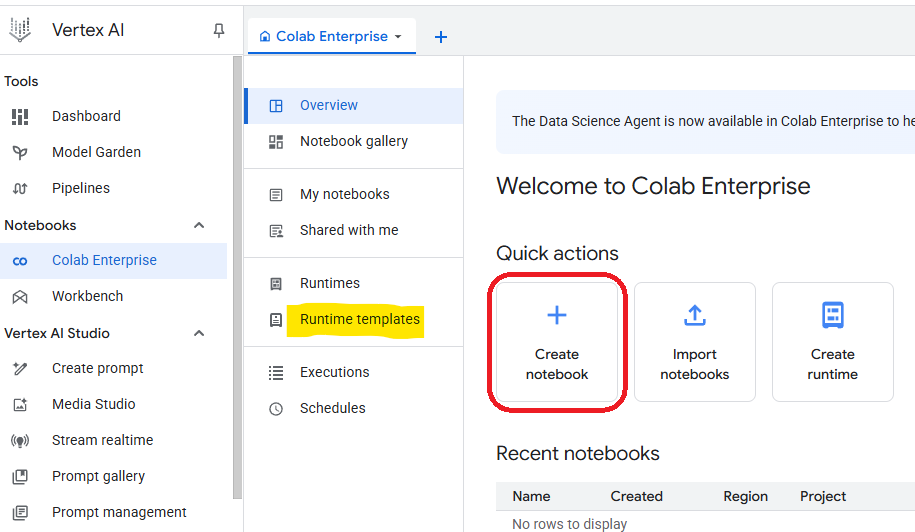


  

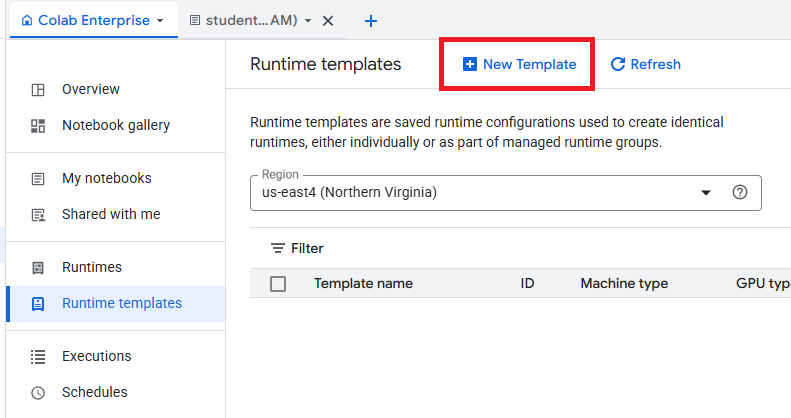
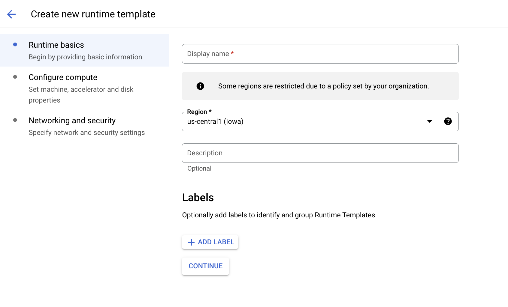
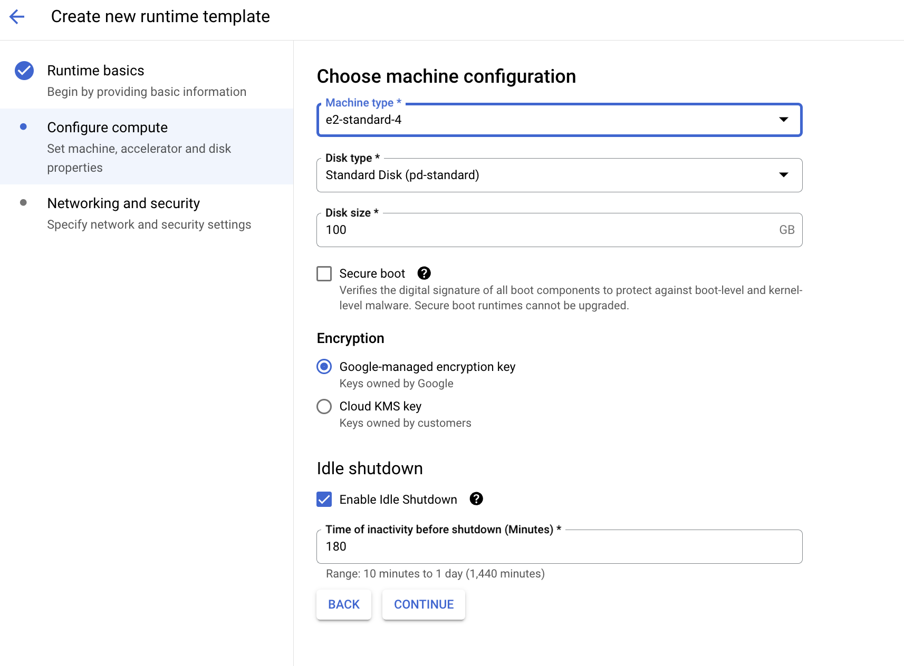
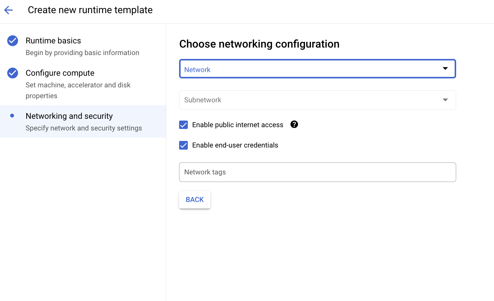

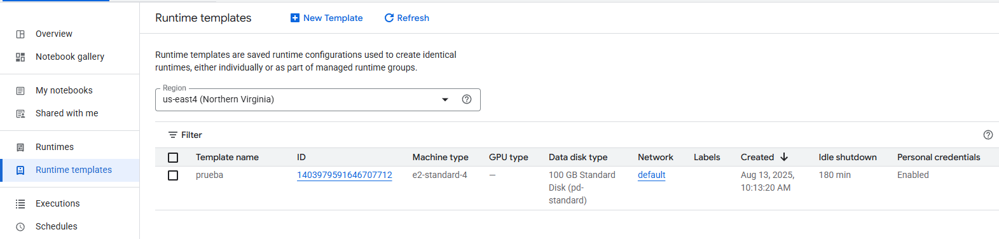


#

## Tarea 3. Ejecuta código en un notebook de Colab Enterprise


1. Haz clic en Colab Enterprise y, luego, en el notebook que creaste.

2. Copia el código que se muestra a continuación y haz clic en el ícono **"RUN"** para **ejecutar** la celda.

```py
# usa NumPy para generar algunos datos aleatorios y matplotlib para visualizarlos.

    import numpy as np
    from matplotlib import pyplot as plt

    ys = 200 + np.random.randn(100)
    x = [x for x in range(len(ys))]

    plt.plot(x, ys, '-')
    plt.fill_between(x, ys, 195, where=(ys > 195), facecolor='g', alpha=0.6)

    plt.title("Sample Visualization")
    plt.show()

```


3 - Ahora, haz un cambio en el código. Por ejemplo, cambia el título del gráfico de "Visualización de muestra" a "Colab Enterprise". Luego, ejecuta la celda.

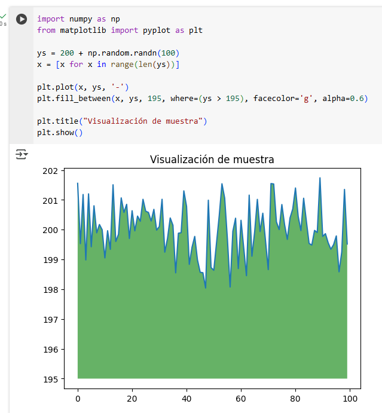

#

## Tarea 4. Muestra el historial de revisión

Una de las características más importantes del desarrollo de software es la capacidad de hacer un seguimiento del historial de versiones.

1 - Ve a la sección Almacenamiento de notebooks. Haz clic en los tres puntos junto al notebook que creaste.

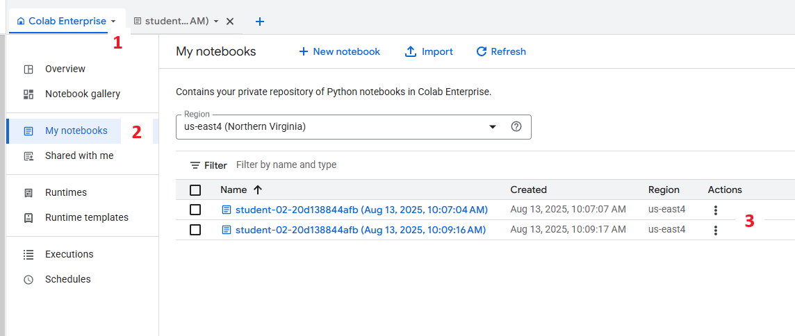

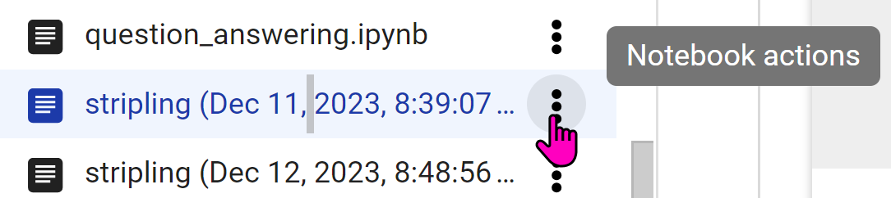

2 - Selecciona Historial de revisión ( **1** ).

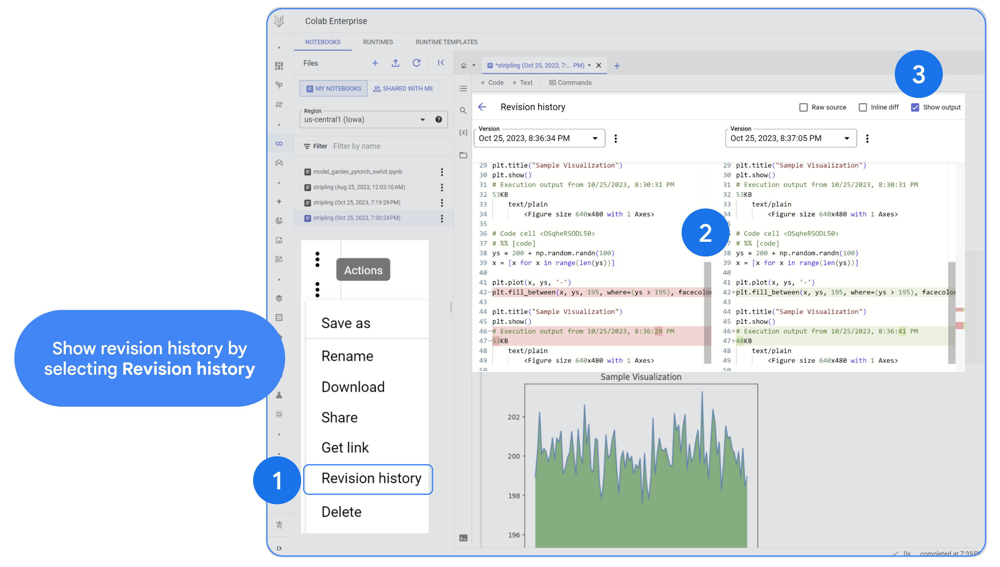

Cuando se selecciona el historial de revisión, verás los cambios uno al lado del otro con una fecha y un código de color para ver el "antiguo" en rojo y el "nuevo" en verde ( **2**). 

Hay tres opciones para visualizar el historial de revisión: el código fuente sin procesar, las diferencias intercaladas o el resultado del código fuente (**3**).

#

## Tarea 5. Agrega código a las celdas


Ahora, agregarás varios bloques de código al notebook. Después de copiar un bloque de código, ejecútalo para ver el resultado. Nota: Algunas celdas no tendrán resultado (como cuando importas las bibliotecas). Cuando termines, comparte el notebook.

Vuelve a la sección de almacenamiento de notebooks y, luego, haz clic en tu notebook.
Vuelve a ejecutar el primer código.
Agrega una celda de código.
Copia el código que se muestra a continuación en la nueva celda.

## Importa las bibliotecas

```
import seaborn as sns
import pandas as pd
import numpy as np
from google.cloud import bigquery
bq = bigquery.Client()

```

Haz clic en el ícono Ejecutar para ejecutar la celda.
No debería aparecer ningún resultado.


## Importa el cliente de BigQuery

```py
# inicializar un cliente de BigQuery.
# El cliente de BigQuery se usará para enviar y recibir mensajes de la API de BigQuery.

client = bigquery.Client()

query = """SELECT * FROM `bigquery-public-data.catalonian_mobile_coverage_eu.mobile_data_2015_2017` LIMIT 1000"""
job = client.query(query)
df = job.to_dataframe()

```

No se muestra ningún resultado.

Descarga una tabla de BigQuery en un DataFrame de Pandas

En Google, **%%bigquery** es un comando mágico que se usa en los notebooks de Jupyter y otros entornos interactivos para interactuar con BigQuery. 

Por lo tanto, **%%bigquery** le indica a tu entorno que cambie al modo de BigQuery: 

- prepara el entorno para aceptar y ejecutar consultas de BigQuery. BigQuery ejecutará la consulta, recuperará los datos y los presentará en el entorno del notebook, a menudo, como un DataFrame de Pandas.

```
%%bigquery df
SELECT *
FROM `bigquery-public-data.catalonian_mobile_coverage_eu.mobile_data_2015_2017`

```
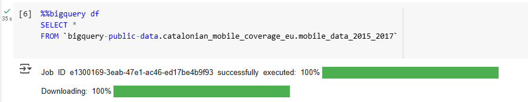

## Muestra las primeras cinco filas del DataFrame de Pandas

```
df.head()
```


## Obtén información sobre el DataFrame de Pandas

```
df.info()
```


## Obtén estadísticas sobre el DataFrame de Pandas

```
df.describe()
```


## Traza una correlación con Seaborn

```
numeric_df = df.select_dtypes(include=[np.number])

corr_matrix = numeric_df.corr()

plt.figure(figsize=(10, 5))
sns.heatmap(corr_matrix, annot=True, vmin=0, vmax=1, cmap='viridis')
plt.show()

```

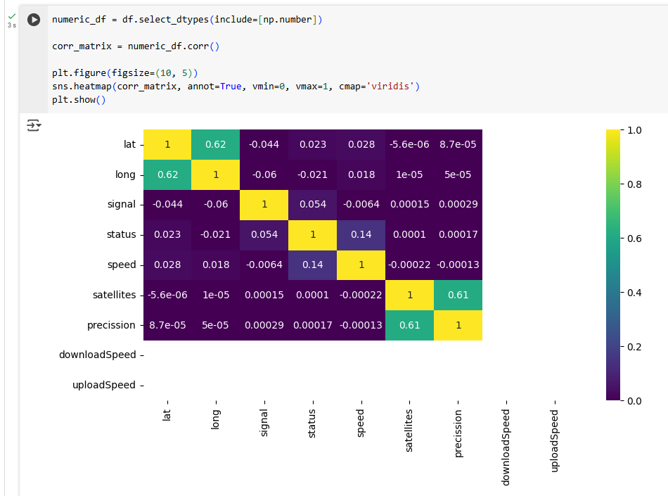

## Escribe una consulta en SQL para seleccionar campos específicos de un conjunto de datos de BigQuery


```
%%bigquery df2
SELECT signal, status
FROM `bigquery-public-data.catalonian_mobile_coverage_eu.mobile_data_2015_2017`


```

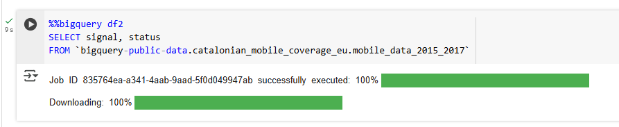

## Obtén las primeras cinco filas de los nuevos campos

```
df2.head()
```
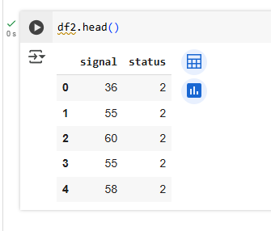


#

## Tarea 6. Comparte el notebook
A continuación, comparte tu notebook.

Cuando seleccionas "Compartir" haciendo clic con el botón derecho en el notebook, aparece una ventana de permisos de uso compartido que te permite editar o borrar permisos, o seleccionar "Agregar principal" para otorgar acceso nuevo.

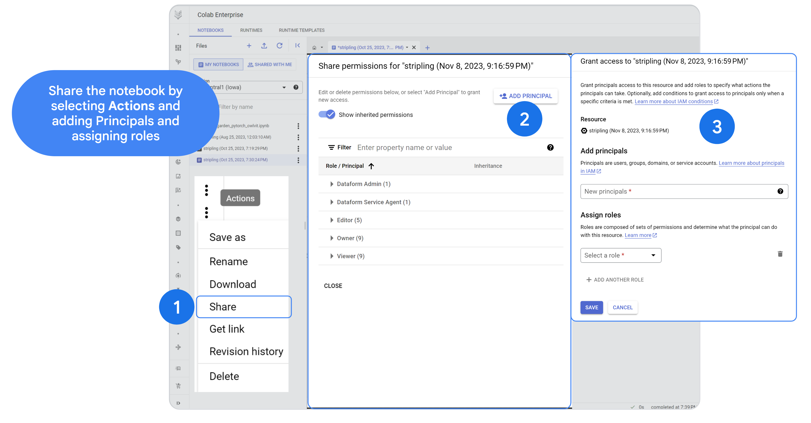


Cuando otorgas a las principales acceso a un recurso, también agregas roles para especificar qué acciones pueden realizar. De manera opcional, puedes agregar condiciones para otorgar acceso a las principales solo cuando se cumplan criterios específicos.
Las principales son usuarios, grupos, dominios o cuentas de servicio. Los roles se componen de conjuntos de permisos y determinan lo que la principal puede hacer con este recurso.