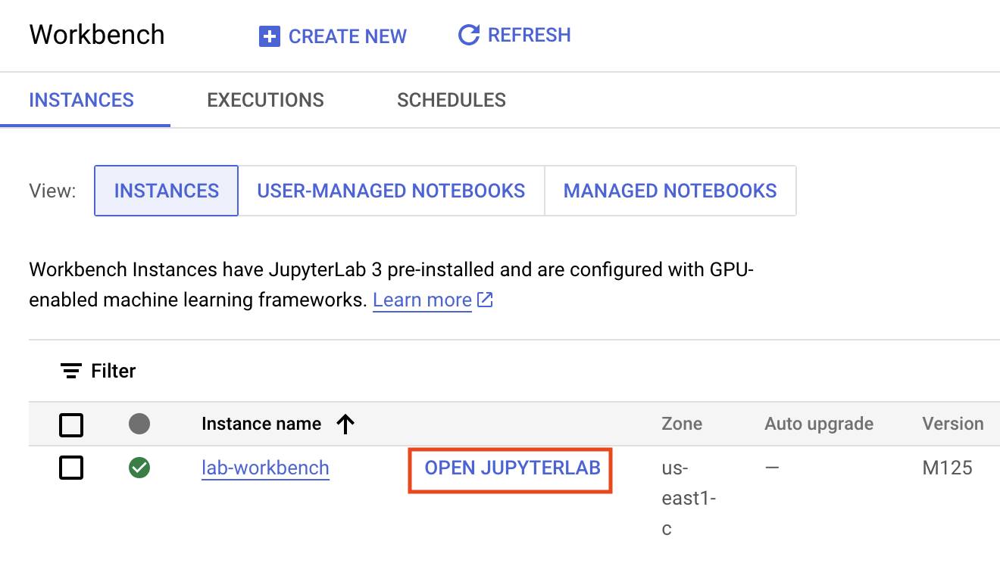
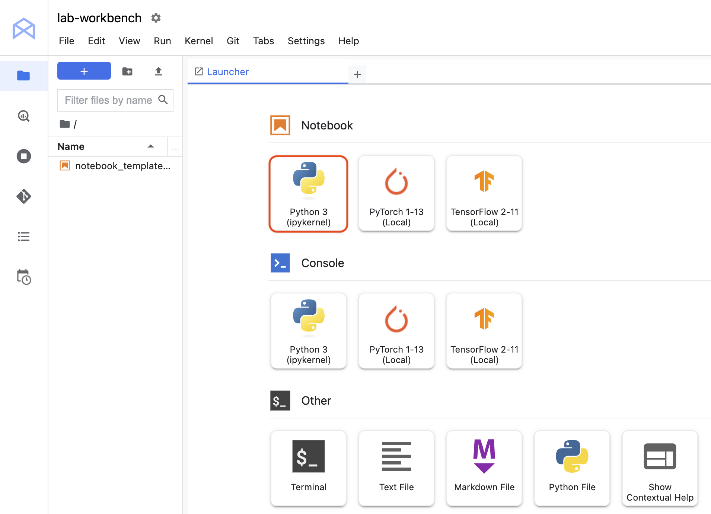
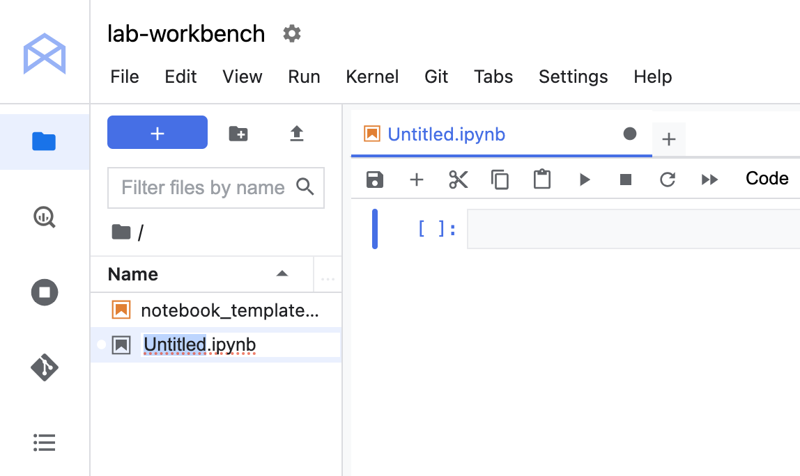
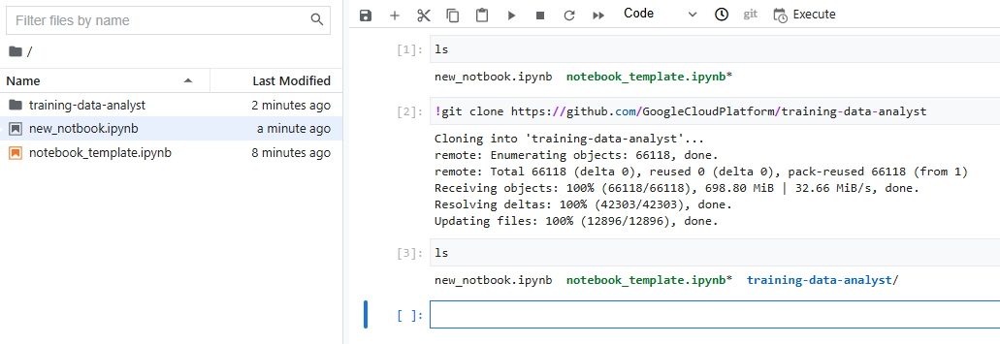
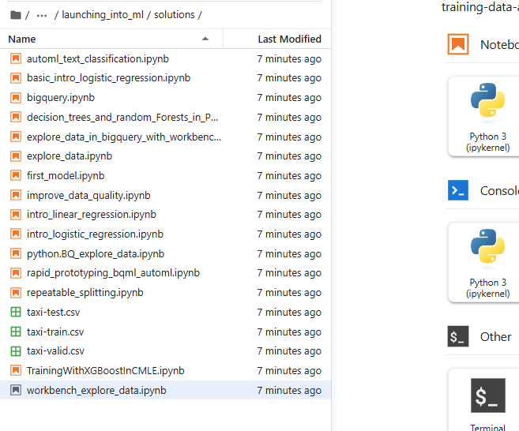

# 📊 Análisis exploratorio de datos con Vertex AI Workbench y BigQuery


## Descripción general
En este laboratorio aprenderás a realizar un análisis exploratorio de datos (EDA) sobre un conjunto de datos almacenado en BigQuery, utilizando un notebook ejecutado en una instancia de **Vertex AI** Workbench.

El objetivo es descubrir patrones y tendencias en los datos a través de consultas SQL, análisis estadístico con Pandas y visualizaciones con Seaborn.

## Objetivos de aprendizaje

- Crear un cuaderno de instancias de Workbench
- Conectarse a conjuntos de datos de BigQuery
- Realizar análisis estadístico en un marco de datos de Pandas
- Crear gráficos de Seaborn para el análisis exploratorio de datos en Python
- Escriba una consulta SQL para seleccionar campos específicos de un conjunto de datos de BigQuery


---
## Contexto

**Vertex AI** es la plataforma unificada de Google Cloud para desarrollar, entrenar y desplegar modelos de aprendizaje automático (AA).

**Vertex AI Workbench** ofrece un entorno **JupyterLab** completamente configurable y escalable para científicos de datos que migran sus proyectos a la nube.

**BigQuery** es un almacén de datos sin servidor que permite ejecutar consultas SQL de forma rápida y sencilla sobre grandes volúmenes de datos.

Este laboratorio combina estas tecnologías para que puedas analizar datos de forma eficiente y visualizarlos en notebooks interactivos.

## WORKBENCH (Banco de trabajo)

**Vertex AI Workbench** es una buena opción para proyectos que priorizan el control y la personalización. Es ideal para proyectos complejos que abarcan varios archivos y tienen dependencias complejas. También es una buena opción para un científico de datos que está migrando a la nube desde una estación de trabajo o un portátil.

Las instancias de Vertex AI Workbench vienen con un conjunto preinstalado de paquetes de aprendizaje profundo, incluido soporte para los marcos TensorFlow y PyTorch.


#

# Labortorio

#

## Tarea 1. Crear un cuaderno de banco de trabajo
1. -En la consola de Google Cloud, desde el menú de Navegación (Menú de navegación), seleccione **Vertex AI** .

- Haga clic en **Enable All Recommended APIs** .

- En el menú de Navegación , haga clic en **Workbench** .

    En la parte superior de la página Workbench, asegúrese de estar en la **vista Instancias** .

- Hacer cli **+Create New** .

    Configurar la instancia :

    Nombre : ` lab-workbench`          
    Región : Establezca la `región`.  
    Zona : Establezca la `zona`.  

    Opciones avanzadas (opcional): si es necesario, haga clic en "Opciones avanzadas" para una mayor personalización (por ejemplo, tipo de máquina, tamaño del disco).

- Haga clic en **Crear** .

   

La creación de la instancia **tardará unos minutos**. 

- Haga clic en **"Abrir Jupyterlab"** junto al nombre de la instancia para iniciar la interfaz de JupyterLab. Se abrirá una nueva pestaña en su navegador.

- Haga clic en el ícono de **Python 3** para iniciar un nuevo cuaderno de Python.

- Haga clic derecho en el `Untitled.ipynb` archivo en la barra de menú y seleccione **Rename Notebook**.

    Tu entorno está configurado. Ya puedes empezar a trabajar con tu notebook Vertex AI Workbench.







#

##  Tarea 2. Clonar un repositorio dentro de su instancia de Vertex AI Notebook
El repositorio de GitHub contiene el archivo de laboratorio y los archivos de soluciones del curso.

1. Copie y ejecute el siguiente código en la primera celda de su cuaderno para clonar el training-data-analystrepositorio.

    ```sh
    !git clone https://github.com/GoogleCloudPlatform/training-data-analyst
    ```



2. Confirme que ha clonado el repositorio. Haga doble clic en el `training-data-analyst` directorio y asegúrese de poder ver su contenido.

3. En la interfaz del cuaderno, navegue a **training-data-analyst > cursos > machine_learning > deepdive2 > launching_into_ml > soluciones** y abra `workbench_explore_data.ipynb` .

    

4. En la interfaz del cuaderno, haga clic en **Edit > Clear All Outputs**.

5. Seleccionar **kernel** , elija **Python 3** de la lista de kernels disponibles.

6. Lea atentamente las instrucciones del cuaderno.


# Notebbok --> [workbench_explore_data](<workbench_explore_data (1).ipynb>)